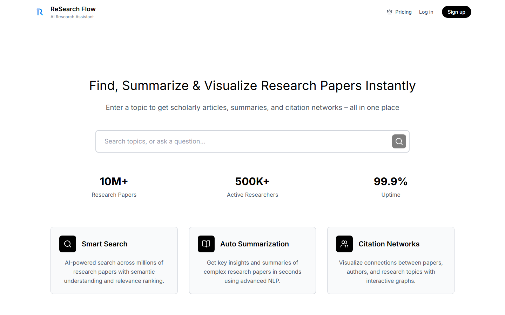
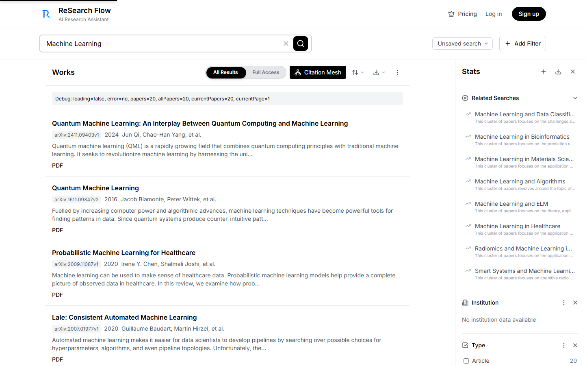
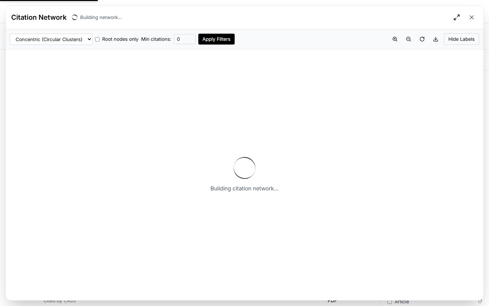

# ReSearch Flow — AI-Powered Academic Research Assistant
## Final Year Project Documentation & Evaluation Report

| Field | Details |
|-------|---------|
| **Project Title** | ReSearch Flow: An AI-Powered Academic Research Assistant |
| **University** | University of the Punjab, Lahore |
| **Department** | Data Science, FCIT |
| **Supervisor** | Dr. Khurram Shahzad |
| **Academic Year** | 2024–2025 |

### Team Members

| Roll No. | Name | Role |
|----------|------|------|
| BSDSF22M054 | Shahzeb Ali | Backend Development & System Architecture |
| BSDSF22M048 | Areesha Rizwan | Database Administration & Schema Design |
| BSDSF22M020 | Haroon Mahmood | Web Deployment & DevOps |
| BSDSF22M028 | Maryam Abid | Frontend Development & UI/UX |

---

## 1. Executive Summary

**ReSearch Flow** is a full-stack, AI-powered academic research platform built as a Final Year Project for the BS Data Science programme at the University of the Punjab. The system solves a core problem faced by every researcher: the fragmented, time-consuming process of discovering, reading, and synthesising scholarly literature.

The platform aggregates research papers from **five distinct academic sources** (OpenAlex, arXiv, PubMed Central, CORE, and Semantic Scholar), applies intelligent **Title-Based Fuzzy Deduplication** across results, visualises inter-paper relationships using a real-time **Citation Mesh** powered by graph-theoretic algorithms (PageRank + In-Degree Centrality), and leverages **Large Language Models** via OpenRouter to produce structured, section-wise summaries of full-length PDF documents.

### Key Achievements
- Multi-source parallel API integration with unified schema normalisation
- Custom PageRank implementation for citation prestige scoring
- Resilient AI summarisation with fallback to abstract-based summarisation for paywalled content
- Interactive, animated Cytoscape.js citation network with bridge-node detection
- Full user authentication (Email + Google OAuth) with per-user saved paper libraries
- Real-time search history and trending topic suggestions powered by OpenAlex


*Figure 1: The ReSearch Flow landing page featuring the intelligent search bar with semantic query detection, live trending topics, and key statistics.*

---

## 2. Problem Statement & Motivation

Academic literature review is one of the most labour-intensive phases of any research project. Researchers typically:
1. Search across multiple disconnected databases (Google Scholar, PubMed, arXiv, etc.)
2. Manually remove duplicate results that appear across sources
3. Read full papers to extract key ideas — often 20–40 pages each
4. Manually trace citations to find foundational or related work
5. Struggle to identify which papers are truly *influential* vs. merely frequently cited

ReSearch Flow addresses all five pain points in a single, unified interface. The platform's value proposition is summarised below:

| Pain Point | ReSearch Flow Solution |
|------------|------------------------|
| Multiple databases to search | Single search bar queries 5 APIs in parallel |
| Duplicate results | Title-based fuzzy deduplication via Pandas |
| Reading full papers | AI-generated structured summaries (Problem → Conclusion) |
| Manual citation tracing | Automated Citation Mesh with depth control |
| Identifying influential work | PageRank + In-Degree Centrality scores on every node |

---

## 3. System Architecture

ReSearch Flow adopts a **3-Tier N-Layer Architecture** based on MVC principles, ensuring clean separation of concerns and horizontal scalability.

```
┌─────────────────────────────────────────────────────┐
│              PRESENTATION LAYER (Tier 1)             │
│   React 19 + Vite + Tailwind CSS 4 + Cytoscape.js   │
│   Framer Motion · Lucide Icons · Three.js (BG)       │
└────────────────────────┬────────────────────────────┘
                         │ HTTP REST API (JSON)
                         ▼
┌─────────────────────────────────────────────────────┐
│           BUSINESS LOGIC LAYER (Tier 2)             │
│              FastAPI (Python 3.12)                  │
│  Search · Normalise · Deduplicate · Graph Metrics   │
│  PDF Extraction · LLM Integration · Auth Middleware │
└────────────────────────┬────────────────────────────┘
                         │
          ┌──────────────┴──────────────┐
          ▼                             ▼
┌─────────────────┐         ┌──────────────────────────┐
│  DATA LAYER     │         │   EXTERNAL SERVICES       │
│  Supabase       │         │  OpenAlex · arXiv · PMC   │
│  (PostgreSQL)   │         │  CORE · Semantic Scholar  │
│  + Supabase Auth│         │  OpenRouter (GPT-4o-mini) │
└─────────────────┘         └──────────────────────────┘
```

### 3.1 Request Lifecycle

1. User enters a topic on the frontend
2. React calls `GET /api/v1/search/fetch?topic=<query>`
3. FastAPI fires parallel requests to OpenAlex, arXiv, PMC, CORE, Semantic Scholar
4. Each source's response is normalised to the unified `Paper` schema (Pydantic)
5. Results are merged, deduplicated, and returned immediately to the frontend
6. A background task (`BackgroundTasks`) asynchronously upserts results into Supabase
7. Frontend renders the paper list; citation graph and summaries are fetched on demand

---

## 4. Technology Stack

### 4.1 Frontend

| Technology | Version | Purpose |
|------------|---------|---------|
| React | 19 | Component-based UI framework |
| Vite | Latest | Fast dev server & build tool |
| Tailwind CSS | 4 | Utility-first styling |
| React Router | v7 | Client-side routing |
| Cytoscape.js | Latest | Citation network graph rendering |
| Framer Motion | Latest | Smooth UI animations |
| Lucide React | Latest | Icon library |
| Three.js | Latest | Animated 3D background |
| jsPDF | Latest | Client-side PDF export |
| xlsx | Latest | Excel export |
| Supabase JS | Latest | Auth & database client |

### 4.2 Backend

| Technology | Version | Purpose |
|------------|---------|---------|
| Python | 3.12 | Core runtime |
| FastAPI | Latest | Async REST API framework |
| Uvicorn | Latest | ASGI server |
| Pydantic | v2 | Data validation & schemas |
| Pandas | Latest | Data cleaning & deduplication |
| Requests / aiohttp | Latest | HTTP clients for external APIs |
| PyMuPDF (fitz) | Latest | PDF text extraction |
| pdfplumber | Latest | Alternative PDF parser |
| pydantic-settings | Latest | Environment config management |

### 4.3 Database & Auth

| Technology | Purpose |
|------------|---------|
| Supabase (PostgreSQL) | Primary relational database |
| Supabase Auth | Email/password + Google OAuth |
| Row Level Security (RLS) | Per-user data isolation |

### 4.4 External API Integrations

| API | Purpose | Auth Required |
|-----|---------|---------------|
| OpenAlex | Primary paper search (free, no key) | No |
| arXiv API | Physics, CS, Math papers | No |
| EuropePMC | Biomedical papers (PubMed Central) | No |
| CORE API | Open access aggregator | API Key |
| Semantic Scholar | Citation graph data | No |
| OpenRouter | LLM gateway (GPT-4o-mini) | API Key |
| SerpAPI | Google Scholar scraping | API Key |

---

## 5. Project Structure

```
FYP-ReSearch-Flow/
│
├── backend/
│   ├── src/app/
│   │   ├── main.py                    # FastAPI entry point, CORS, lifespan
│   │   ├── api/v1/
│   │   │   ├── api_router.py          # Central route registry
│   │   │   └── routes/
│   │   │       ├── search.py          # Primary search endpoint
│   │   │       ├── papers.py          # CRUD for saved papers
│   │   │       ├── citation.py        # Citation network builder
│   │   │       ├── arxiv.py           # arXiv: search/summarize/ask
│   │   │       ├── core.py            # CORE API integration
│   │   │       ├── pmc.py             # PubMed Central integration
│   │   │       ├── semantic_scholar.py
│   │   │       └── google_scholar.py
│   │   ├── core/
│   │   │   ├── config.py              # Pydantic settings (env vars)
│   │   │   └── logging_config.py
│   │   ├── crud/
│   │   │   └── papers_crud.py         # Supabase upsert logic
│   │   ├── db/
│   │   │   └── client_supabase.py     # Supabase client singleton
│   │   ├── models/
│   │   │   └── pydantic_schemas.py    # Paper data model
│   │   ├── services/
│   │   │   ├── openalex_service.py
│   │   │   ├── citation_network_service.py  # PageRank + graph builder
│   │   │   ├── llm_service.py         # OpenRouter/OpenAI calls
│   │   │   ├── summarization_service.py
│   │   │   ├── chat_service.py        # Ask-about-paper Q&A
│   │   │   ├── pdf_service.py
│   │   │   ├── pdf_extractor.py
│   │   │   ├── arxiv_service.py
│   │   │   ├── core_service.py
│   │   │   ├── pmc_service.py
│   │   │   └── semantic_scholar_service.py
│   │   └── utils/
│   │       ├── dedupe.py              # Pandas-based deduplication
│   │       └── retries.py             # Exponential backoff
│   └── requirements.txt
│
├── frontend/src/
│   ├── pages/
│   │   ├── Home.jsx                   # Landing page & search
│   │   ├── Results.jsx                # 3-column results layout
│   │   ├── SavedSearches.jsx          # Bookmarked papers
│   │   └── AuthPage.jsx              # Login/Signup
│   ├── components/
│   │   ├── SearchBar.jsx              # Smart search w/ suggestions
│   │   ├── CitationMesh.jsx           # Cytoscape.js graph
│   │   ├── Navbar.jsx
│   │   └── ArticleNotesModal.jsx
│   ├── contexts/AuthContext.jsx       # Global auth state
│   ├── hooks/useSearchHistory.js      # Search history + trending
│   └── services/api.js               # All API calls
│
├── database/
│   ├── saved_articles_schema.sql
│   └── search_history_schema.sql
│
├── docs/                              # All documentation
├── scripts/                           # Utility scripts
├── run-servers.ps1                    # One-click startup
└── .env.example                       # Environment template
```

---

## 6. Core Modules — Deep Dive

### 6.1 Search & Multi-Source Aggregation

The primary search endpoint (`/api/v1/search/fetch`) orchestrates parallel queries to all configured data sources. Each source has a dedicated service module that:

1. Constructs the source-specific API request
2. Parses the response into the unified `Paper` Pydantic schema
3. Handles rate-limiting, timeouts, and partial failures gracefully

**Unified Paper Schema** (`pydantic_schemas.py`):
```python
class Paper(BaseModel):
    paperId: Optional[str]
    title: str
    abstract: Optional[str]
    authors: List[str] = []
    url: Optional[str]
    year: Optional[int]
    venue: Optional[str]
    citationCount: Optional[int]
    referenceCount: Optional[int]
    referencedWorks: List[str] = []
    isOpenAccess: Optional[bool]
    openAccessPdf: Optional[str]
    externalIds: Dict = {}
    fieldsOfStudy: List[str] = []
    institutions: List[str] = []
    source: Optional[str]
    topic: Optional[str]
    content: Optional[str]
```


*Figure 2: The Results page showing aggregated papers from multiple sources. The three-column layout displays the paper list (left), detailed paper view (centre), and statistics/filters (right).*

### 6.2 Data Deduplication (`dedupe.py`)

After collecting results from multiple APIs, the same paper may appear under slightly different titles (e.g., from arXiv and OpenAlex simultaneously). The `clean_and_deduplicate()` function:

```python
def clean_and_deduplicate(df, topic):
    # Normalise string fields
    df['title'] = df['title'].fillna('N/A').astype(str).str.strip()
    df['abstract'] = df['abstract'].fillna('N/A').astype(str).str.strip()
    # Remove exact-title duplicates
    df = df.drop_duplicates(subset=['title'], keep='first')
    return df
```

Key steps:
- **Schema enforcement**: Ensures all expected columns exist, fills missing values
- **Type coercion**: Numeric fields cast with `pd.to_numeric(..., errors='coerce')`
- **Deduplication**: Title-based, keeping the entry with the richest source data
- **List fields preserved**: Authors, institutions, and referenced works remain as Python lists (stored as JSONB in Supabase)

### 6.3 Intelligent Citation Network

The `citation_network_service.py` module is the most algorithmically rich component of the system. It builds a **bidirectional citation graph** and computes three graph metrics:

#### Graph Construction
The service auto-detects the paper source (Semantic Scholar IDs are 40-char hex strings; OpenAlex IDs start with `W`). It then:
1. Adds all searched papers as **root nodes**
2. Concurrently fetches references (outgoing edges) and citing papers (incoming edges) using `ThreadPoolExecutor(max_workers=5)`
3. Identifies **bridge nodes** — non-root papers connected to 2+ different root papers (visually highlighted in orange)

#### Graph Metrics

**1. Citation Velocity** (recency-weighted impact):
```python
age = max(1, current_year - year)
node["citationVelocity"] = round(citations / age, 2)
```

**2. In-Degree Centrality** (direct influence score):
```python
node["influenceScore"] = round(in_degrees[nid] / max_in_degree, 4)
```

**3. PageRank** (global prestige, 10 iterations, damping factor d=0.85):
```python
d = 0.85
for _ in range(10):
    for node in nodes:
        pr_sum = sum(
            node_map[src]["pageRankScore"] / out_degrees[src]
            for src in incoming_edges[node["id"]]
            if out_degrees[src] > 0
        )
        new_pr[node["id"]] = ((1.0 - d) / num_nodes) + d * pr_sum
```

These scores are normalised to [0, 1] and sent to the frontend where Cytoscape.js maps them to **node size** and **colour intensity**.


*Figure 3: The Citation Mesh showing an interactive graph. Node size encodes PageRank (prestige), node colour encodes In-Degree Centrality (influence), and orange nodes are bridge papers connecting multiple clusters.*

### 6.4 AI Summarisation & Document Q&A

The LLM pipeline (`llm_service.py`) accepts full paper text and produces structured summaries in four sections: Problem Statement, Methodology, Key Findings, and Conclusion.

**Pipeline**:
1. Strip references/bibliography section (regex-based) to save tokens
2. Truncate to 100,000 characters (fits within GPT-4o-mini's 128K context)
3. Call OpenRouter API with `response_format: json_object` to enforce structured output
4. Parse JSON response; fall back to regex-based text extraction if JSON fails
5. If PDF extraction itself fails (paywalled domain), fall back to abstract-based summarisation

**Prompt Engineering**:
```
You are an expert academic researcher. Analyze the following research paper
and provide a detailed, structured summary in EXACTLY this JSON format:
{
  "problem_statement": "...",
  "methodology": "...",
  "key_findings": "...",
  "conclusion": "..."
}
```

**Document Q&A** (`chat_service.py`): The same PDF text is passed as system context, and the user's question is appended as the user message. Conversation history is maintained on the frontend and passed back on each turn for multi-turn dialogue.

### 6.5 Frontend Architecture

The React frontend is structured around three main pages:

#### Home Page (`Home.jsx`)
- Clean hero layout with the smart SearchBar component
- Statistics row: 10M+ papers, 500K+ researchers, 99.9% uptime
- Three feature cards: Smart Search, Auto Summarisation, Citation Networks

#### Results Page (`Results.jsx`)
The most complex component — a three-column layout:
- **Left panel**: Paginated list of paper cards with source badges, year, citation count
- **Centre panel**: Selected paper's full detail view — abstract, authors, institutions, AI summary, and Ask-Paper chat
- **Right panel**: Real-time statistics, year distribution chart, field-of-study breakdown, and filter controls

#### Search Bar (`SearchBar.jsx`)
A sophisticated search component with:
- **Semantic query detection**: Regex patterns detect natural language questions and activate smart keyword extraction
- **Tabbed dropdown**: "Suggestions" (search history + topic autocomplete) and "Trending" (live from OpenAlex)
- **Keyboard navigation**: Arrow keys, Tab to switch tabs, Enter to search, Escape to close
- **Debounced API calls**: 300ms for suggestions, 500ms for trending topics

### 6.6 Database Design

#### `research_papers` Table
The main paper store. Uses JSONB for flexible array/object fields:

| Column | Type | Description |
|--------|------|-------------|
| paperId | TEXT (PK) | Unique paper identifier |
| title | TEXT | Paper title |
| abstract | TEXT | Paper abstract |
| authors | JSONB | Array of author names |
| url | TEXT | Link to paper |
| year | INTEGER | Publication year |
| venue | TEXT | Journal/conference name |
| citationCount | INTEGER | Number of citations |
| referencedWorks | JSONB | List of cited paper IDs |
| isOpenAccess | BOOLEAN | Open access status |
| openAccessPdf | TEXT | Direct PDF URL |
| fieldsOfStudy | JSONB | Research domains |
| institutions | JSONB | Author institutions |
| source | TEXT | API source (openalex, arxiv, etc.) |
| topic | TEXT | Search topic |

#### `saved_articles` Table
Per-user bookmarks with Row Level Security:

```sql
CREATE TABLE saved_articles (
    id          UUID PRIMARY KEY DEFAULT gen_random_uuid(),
    user_id     UUID NOT NULL REFERENCES auth.users(id) ON DELETE CASCADE,
    paper_id    TEXT NOT NULL,
    title       TEXT NOT NULL,
    notes       TEXT,
    created_at  TIMESTAMP WITH TIME ZONE DEFAULT NOW(),
    updated_at  TIMESTAMP WITH TIME ZONE DEFAULT NOW(),
    UNIQUE(user_id, paper_id)
);
ALTER TABLE saved_articles ENABLE ROW LEVEL SECURITY;
-- RLS: Users can only access their own rows
CREATE POLICY "own_articles" ON saved_articles
    USING (auth.uid() = user_id);
```

An auto-trigger updates `updated_at` on any modification.

---

## 7. API Endpoints Reference

| Method | Endpoint | Description |
|--------|----------|-------------|
| GET | `/health` | Backend health check |
| GET | `/api/v1/search/fetch` | Search papers (topic, limit, sources) |
| GET | `/api/v1/papers` | Retrieve stored papers by topic |
| POST | `/api/v1/citation/network` | Build citation graph for paper list |
| GET | `/api/v1/arxiv/search` | Search arXiv |
| POST | `/api/v1/arxiv/summarize` | AI summarise an arXiv paper |
| POST | `/api/v1/arxiv/ask` | Q&A on an arXiv paper |
| GET | `/api/v1/pmc/search` | Search PubMed Central |
| POST | `/api/v1/pmc/summarize` | AI summarise a PMC paper |
| POST | `/api/v1/pmc/ask` | Q&A on a PMC paper |
| GET | `/api/v1/core/search` | Search CORE API |
| POST | `/api/v1/semantic-scholar/search` | Search Semantic Scholar |

---

## 8. Authentication & Security

Authentication is handled entirely by **Supabase Auth**, supporting:
- **Email/Password** signup and login with email verification
- **Google OAuth** via Supabase's OAuth provider integration

The frontend stores session tokens in Supabase's built-in session management. The `AuthContext.jsx` React context exposes `user`, `session`, `signIn`, `signOut`, and `signUp` to all components.

**Security measures**:
- Row Level Security (RLS) ensures users can only read/write their own saved articles
- API keys are stored in `.env` files (not committed to Git)
- CORS is restricted to the configured frontend origin
- All backend endpoints perform schema validation via Pydantic

---

## 9. Data Flow Diagrams

### 9.1 Search Flow
```
User Input
    │
    ▼ GET /api/v1/search/fetch
FastAPI (search.py)
    │
    ├──► OpenAlex API ──► Normalise ──┐
    ├──► arXiv API ─────► Normalise ──┤
    ├──► PMC API ────────► Normalise ──┼──► Merge & Deduplicate (Pandas)
    ├──► CORE API ───────► Normalise ──┤        │
    └──► Semantic Scholar► Normalise ──┘        ▼
                                        Return to Frontend (immediate)
                                                │
                                        Background Task
                                                │
                                        Supabase Upsert (batch)
```

### 9.2 Citation Network Flow
```
User clicks "Citation Mesh"
    │
    ▼ POST /api/v1/citation/network
citation_network_service.py
    │
    ├──► ThreadPoolExecutor (5 workers)
    │       ├── fetch references (outgoing edges)
    │       └── fetch citations (incoming edges)
    │
    ├──► Compute PageRank (10 iterations)
    ├──► Compute In-Degree Centrality
    ├──► Compute Citation Velocity
    └──► Identify Bridge Nodes
    │
    ▼ Return {nodes, edges, stats}
Cytoscape.js (CitationMesh.jsx)
    └── Render interactive graph
```

### 9.3 AI Summarisation Flow
```
User clicks "Summarise"
    │
    ▼ POST /api/v1/arxiv/summarize (or pmc/core)
pdf_extractor.py
    ├── Try: Download & extract PDF text (PyMuPDF)
    └── Fallback: Use title + abstract if domain is blocked
    │
    ▼
llm_service.py
    ├── Strip references section
    ├── Truncate to 100K chars
    └── Call OpenRouter API (GPT-4o-mini)
            │
            ▼ JSON response
    Parse structured summary
    {problem_statement, methodology, key_findings, conclusion}
    │
    ▼
Return to Frontend → Display in Detail Panel
```

---

## 10. Setup & Deployment Guide

### Prerequisites
- Python 3.12+
- Node.js 18+
- A Supabase project (free tier works)
- OpenRouter API key (for AI summarisation)

### Quick Start

**Step 1: Clone & configure**
```bash
git clone https://github.com/Shahzeb-Ali-Web-Developer/FYP-ReSearch-Flow.git
cd FYP-ReSearch-Flow
cp .env.example backend/.env   # Fill in your API keys
```

**Step 2: Backend**
```bash
cd backend
python -m venv venv
.\venv\Scripts\Activate.ps1
pip install -r requirements.txt
```

**Step 3: Frontend**
```bash
cd frontend
npm install
```

**Step 4: Launch both servers**
```powershell
.\run-servers.ps1
```

**Verify**:
- Frontend: http://localhost:5173
- Backend API: http://localhost:8000/health
- Interactive API Docs: http://localhost:8000/docs

### Environment Variables

**`backend/.env`**:
```
SUPABASE_URL=https://xxxx.supabase.co
SUPABASE_KEY=your_service_role_key
OPENROUTER_API_KEY=your_openrouter_key
CORE_API_KEY=your_core_key          # Optional
SERPAPI_API_KEY=your_serpapi_key    # Optional
```

**`frontend/.env`**:
```
VITE_API_URL=http://127.0.0.1:8000/api/v1
VITE_SUPABASE_URL=https://xxxx.supabase.co
VITE_SUPABASE_ANON_KEY=your_anon_key
```

---

## 11. Features Summary

| Feature | Status | Module |
|---------|--------|--------|
| Multi-source paper search | ✅ Complete | search.py, all *_service.py |
| Real-time fuzzy deduplication | ✅ Complete | dedupe.py |
| Paper details panel | ✅ Complete | Results.jsx |
| Advanced filters (year, type, OA) | ✅ Complete | Results.jsx |
| Statistics dashboard | ✅ Complete | Results.jsx |
| AI Summarisation (PDF) | ✅ Complete | llm_service.py |
| Paywall fallback summarisation | ✅ Complete | summarization_service.py |
| Ask About This Paper (Q&A) | ✅ Complete | chat_service.py |
| Citation Mesh (PageRank) | ✅ Complete | citation_network_service.py |
| Bridge node detection | ✅ Complete | citation_network_service.py |
| Citation Velocity metric | ✅ Complete | citation_network_service.py |
| User authentication (Email + OAuth) | ✅ Complete | AuthContext.jsx |
| Save & bookmark papers | ✅ Complete | papers_crud.py |
| Per-user notes on papers | ✅ Complete | ArticleNotesModal.jsx |
| Export to PDF / Excel | ✅ Complete | Results.jsx |
| Search history & trending | ✅ Complete | useSearchHistory.js |
| Semantic NLP query detection | ✅ Complete | SearchBar.jsx |

---

## 12. Conclusion & Future Work

ReSearch Flow successfully demonstrates a production-grade, full-stack research platform built entirely by a four-person undergraduate team. The project goes well beyond basic API integration by implementing original algorithmic work:

- A **custom PageRank** implementation tuned for academic citation graphs
- A **multi-threaded concurrent graph builder** using Python's `ThreadPoolExecutor`
- A **resilient LLM pipeline** with automatic fallback strategies
- A **bridge-node detection algorithm** for identifying cross-cluster connectors

### Future Enhancements
1. **Semantic search**: Replace keyword search with embedding-based vector similarity
2. **Recommendation engine**: Suggest papers based on user reading history
3. **Collaborative libraries**: Shared paper collections for research groups
4. **Docker containerisation**: One-command deployment via Docker Compose
5. **CI/CD pipeline**: GitHub Actions for automated testing and deployment
6. **Mobile PWA**: Progressive Web App for mobile access

---

*Document generated: May 2025*
*ReSearch Flow v1.0 — University of the Punjab, Lahore*
